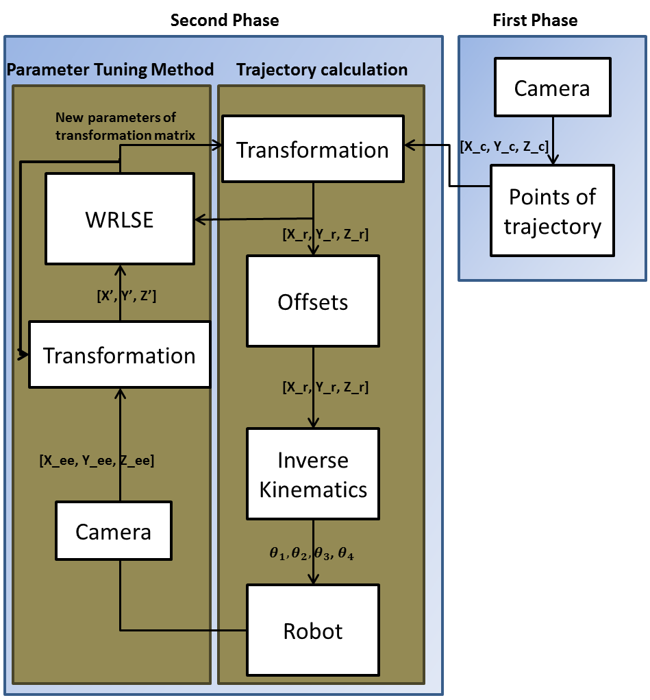
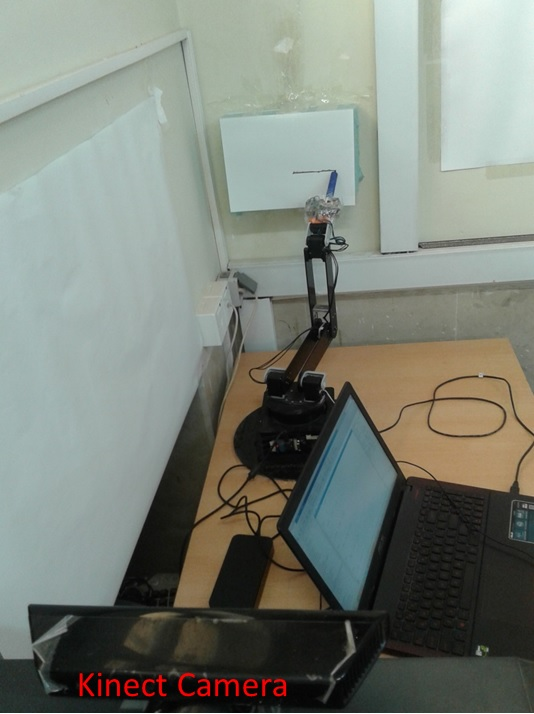

# Adaptive-Visual-Servoing-Control-of-robot-Manipulator-for-Trajectory-Tracking-tasks-in-3D-Space
This paper presents an adaptive visual servoing
controller for trajectory tracking in the robotic manipulators.
The proposed controller is based on the inverse kinematic model
of a robotic manipulator (Arm-6Ax18) and position-based visual
servoing control. In this research work a Kinect camera, which is
fixed as an eye-to-hand configuration, is used for extracting the
trajectory in the color and depth images. Using this information,
the geometric coordinates of points in Kinect coordinate space
are calculated. Afterwards, these coordinates are converted to
the robot’s coordinate space using an obtained transformation
matrix. The parameters of this matrix are calculated using
Linear Least Squares Estimator (LSE) method. Then, the inverse
kinematic model of manipulator is applied on these coordinates
to determine the angle of each robot’s joint. Due to the brightness
intensity and other uncertainties, the Kinect camera has error
in the calculation of depths. To cope this problem, an adaptive
learning algorithm, called Weighted Recursive Least Square
Estimator (WRLSE), is applied. This algorithm adaptively tunes
the parameters of transformation matrix in order to reduce
the distances between end-effector’s trajectory and reference
trajectory. For tracking the reference trajectory, Canny edge
detector is used to detect the trajectory in the image. Thereafter,
the detected trajectory is discretized to the set of target points
which should be reached by the end-effector. The proposed
adaptive controller is applied on a real robotic manipulator. The
experimental results show that by using the adaptive learning
algorithm, the end-effector can track the trajectory with high
accuracy.

The block diagram of proposed adaptive controller
A. 

The robotic manipulator ARM-6Ax18 and the XBOX-360 Kinect
camera.

